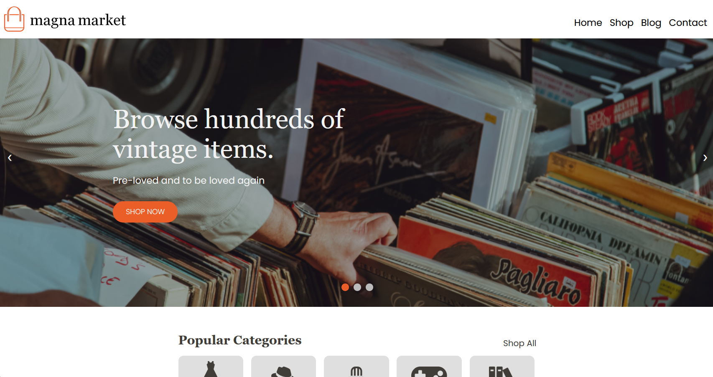

# Magna Market
You can view a live version here:
https://magnamarket.onrender.com 

This website was originally made for the Conestoga College Skills 2023 competition. It is a simple but responsive static ecommerce website for 
a consignment store that includes a home, shop, contact and blog page. Some UI features include an image carousel, an accordion, and a 
collapsible navigation menu.

This project was created using 
 * HTML
 * CSS
 * JavaScript

To run this project:
1. Clone this repo.
2. Navigate to the folder where you cloned the repo.
3. Double click index.html to view the home page of the website.
